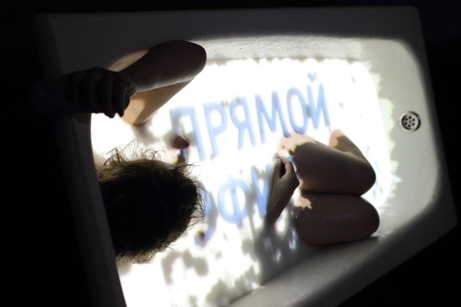

# Елена Деми-дова

Медиахудожник, перформер, куратор исследовательского проекта «MEDIA BODY MEDIA», Елена работает со словом и телом, изучает мультимодальность сенсорного восприятия, исследует возможности мультисенсорной коммуникации, разрабатывает интерактивные технологические скульптуры и объекты-компаньоны, а также работает в направлении интерактивного медиаперформанса.

Ведет арт-практики и лаборатории (“Тело текста”, “Молчаливые практики” ), преподает на курсе “Арт-коучинг и арт-педагогика” в Московском институте психоанализа.

Участник российских и международных фестивалей с 2009 г.

Образование:
- магистратура управления инновациями ВШЭ (темы исследования: инновации и Art&Science, технологии сенсорного замещения, аугментация человека) Москва, 2021 
- художественно-графический факультет  ПГГУ Москва, 2009 
- школа "Свободные мастерские", лаборатория медиаперформанса, Москва, 2012 

 Изучала перформанс в лабораториях (2009-2020)
- "Theatrum", образовательный проект фестиваля “Золотая маска”.
- Мартина Нашбара, Пас Рохо, Реми Ретье, Джеса Куртиса Летней школы ЦЕХ;
- поэтического перформанса Натали Мали, КРЯК, Красноярск,

Призер:
- фестиваля молодой драматургии “Любимовка” в номинации “спорная территория”, Москва, 2017
- шорт-лист международной премии электронной литературы ELO 01, Неаполь, Италия, 2014
- фестиваля медиапоэзии “Вентилятор” в номинации “Перформанс”. Санкт-Петербург, 2009

Избранные художественные проекты: 
- “Матрешкаленд”, МОММА, Москва, 2013
- “Мироточение”, Фестиваль перформанса “Игра в классики”, ММОМА, Москва,2013; КРЯК, Красноярск 2014
- интерактивный медиаперформанс «Хочу сказать!», инструмент «Коммуникатор» совместно с Олегом Макаровым, Андреем Андриановым, Сергеем Синодовым, Ириной Иванниковой, Полиной Синевой, Культурный центр ZIL, Москва, 2014
- “Медиадрузья”, “Искусство быть”, ГЦСИ РОСИЗО, 2019 

Избранные осуществленные кураторские проекты: 
- “Фестиваль медиапоэзии” Открытая сцена, ММОМА, Москва 2013
- “Лаборатория медиапоэзии” Открытая сцена, ММОМА, Москва 2013
- "Медиапоэтические машины" резиденция, галерея-мастерская “Сколково”,  Москва, 2013
- “Транскрипция шума”специальный проект 6-й московской международной биеннале современного искусства, Дарвиновский музей, Москва, 2014, ПМЭФ, Санкт-Петербург, 2017
- “Тактильный коммуникатор” проект сайнс-арт московский Политех, Москва, 2017-2019.
- “Свобода и нейротехнологии” Neuro_Science_Art международная конференция Центр нейроэкономики и когнитивных исследований ВШЭ 2021 

Публикации:

- 2015  -  "Медиапоэзия: как рассчитать технологию вдохновения, выстроить шум в математическом порядке, читать поэзию на ощупь и рифмовать цифры". "Медиатека и мир" РГБ.
- 2020 - со-автор Ксения Федорова, "[Qualia Formation through Sensory Substitution in Artistic Laboratories in Russia](https://isea-archives.siggraph.org/presentation/qualia-formation-through-sensory-substitution-in-artistic-laboratories-in-russia/)" Why Senstience? 26th International Symposium on Electronic Arts (ISEA), Montreal.

mediabodymedia@gmail.com
